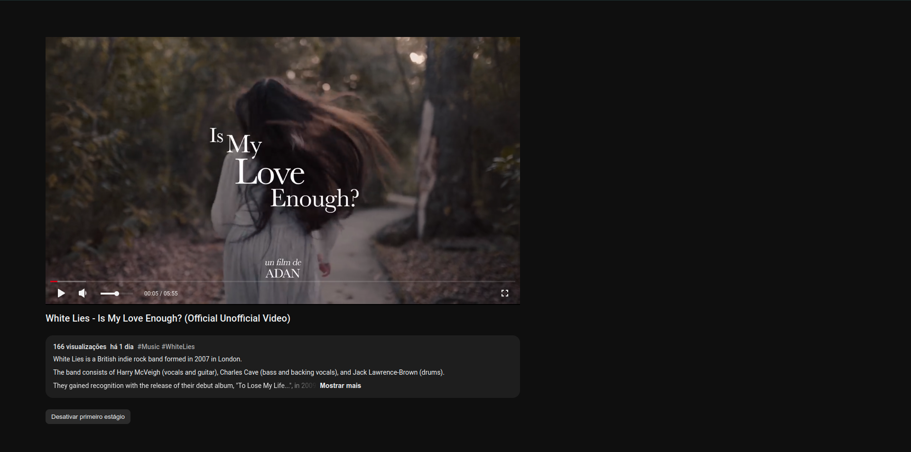
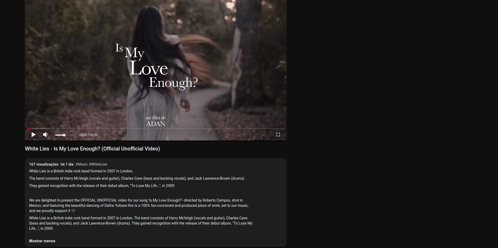
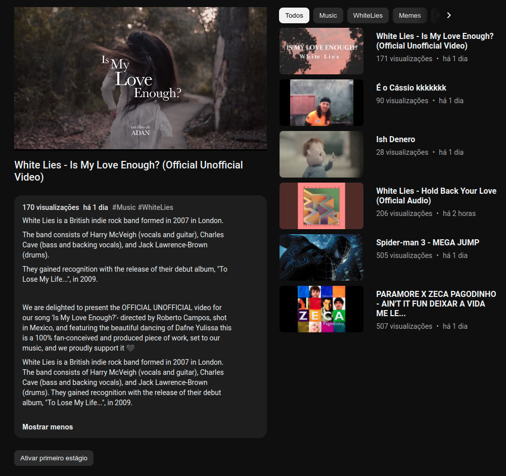

# YouTube com Next.js
> Clone do YouTube construído com Next.js. Criando um player de vídeo, permitindo ao usuário assistir a vídeos, pausar, colocar em tela cheia, ir para uma parte específica do vídeo.

    
    
    
    
    

## Funcionalidades
- Visualizar vídeos de uma lista disponível no MongoDB.
- Obter informações sobre os vídeos, como título, descrição e visualizações.
- Exibir thumbnails dos vídeos hospedados no Google Cloud Platform.

